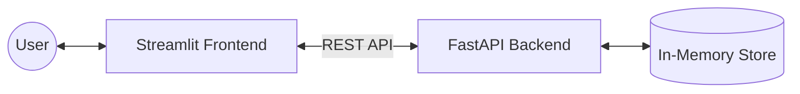

# ✅ Task Manager: Full-Stack FastAPI & Streamlit

A lightweight, full-stack Task Management application featuring a **FastAPI** REST backend and a **Streamlit** interactive frontend.

## 🏗️ Project Architecture

This project follows a decoupled architecture where the Frontend communicates with the Backend via a RESTful API.

🛠️ Prerequisites
Python 3.12.x (Required for package compatibility)
Git (For cloning the repository)
🚀 Quick Start Guide
1. Clone & Setup Environment
powershell
# Clone the project (or just enter your folder)
cd your-project-folder

# Create a virtual environment using Python 3.12
python -m venv .venv

# Activate the environment
# On Windows:
.venv\Scripts\activate
# On Mac/Linux:
source .venv/bin/activate

# Install dependencies
pip install -r requirements.txt
Use code with caution.

2. Run the Application
You will need two separate terminals running at the same time:
Terminal 1: The Backend (FastAPI)
powershell
uvicorn main:app --reload
Use code with caution.

API URL: http://127.0.0
Interactive Docs (Swagger): http://127.0.0
Terminal 2: The Frontend (Streamlit)
powershell
streamlit run frontend.py
Use code with caution.

Web UI: Usually opens at http://localhost:8501
📝 API Endpoints
Method	Endpoint	Description
GET	/tasks	List all tasks (includes filters)
POST	/tasks	Create a new task
PATCH	/tasks/{id}	Partially update a task (e.g., mark Done)
DELETE	/tasks/{id}	Remove a task permanently
📂 Project Structure
main.py - FastAPI application logic and Pydantic models.
frontend.py - Streamlit UI and API request handling.
requirements.txt - Project dependencies (FastAPI, Streamlit, Pydantic, etc.).
