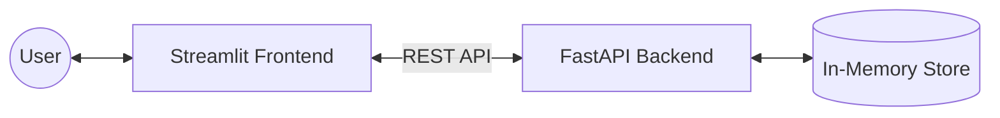

# ✅ Task Manager: Full-Stack FastAPI & Streamlit

A lightweight, full-stack Task Management application featuring a **FastAPI** REST backend and a **Streamlit** interactive frontend.

## 🏗️ Project Architecture

This project follows a decoupled architecture where the Frontend communicates with the Backend via a RESTful API.

🛠️ Prerequisites    
Python 3.12.x (Required for package compatibility)  
Git (For cloning the repository)  
🚀 Quick Start Guide      
powershell
# Clone the project (or just enter your folder)  
cd your-project-folder

# Create a virtual environment using Python 3.12  
python -m venv .venv  

# Activate the environment  
# On Windows:
.venv\Scripts\activate  
# On Mac/Linux:  
source .venv/bin/activate  

# Install dependencies  
pip install -r requirements.txt
Use code with caution.

2. Run the Application    
You will need two separate terminals running at the same time:   
Terminal 1: The Backend (FastAPI)  
powershell  
uvicorn main:app --reload  
Use code with caution.  

API URL: http://127.0.0.1/8000/tasks  
Interactive Docs (Swagger): http://127.0.0.1/8000/docs   
Terminal 2: The Frontend (Streamlit)  
powershell 
streamlit run frontend.py  
Use code with caution.  

Web UI: Usually opens at http://localhost:8501
📝 API Endpoints    
Method	Endpoint	Description  
GET	/tasks	List all tasks (includes filters)  
POST	/tasks	Create a new task  
PATCH	/tasks/{id}	Partially update a task (e.g., mark Done)  
DELETE	/tasks/{id}	Remove a task permanently  
📂 Project Structure    
main.py - FastAPI application logic and Pydantic models.  
frontend.py - Streamlit UI and API request handling.  
requirements.txt - Project dependencies (FastAPI, Streamlit, Pydantic, etc.).  
